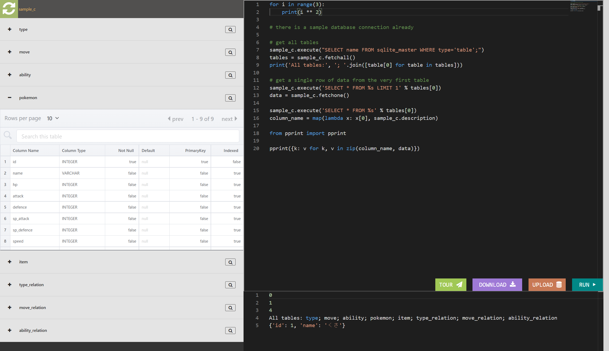
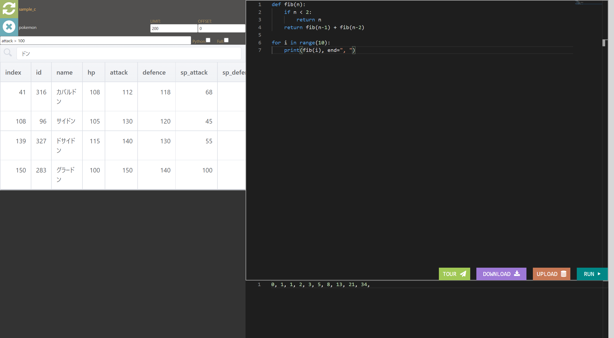

# DBBrowser

Easy to use browser for the DataBases and Python editor.

# Features

on the left side of the screen you can see the databass.

- Visualization of the DataBases
- Run sql queries
- Search visually
- Download the edited DataBases

on the right side of the screen you can see the Python editor.

- Run python code
- Save python code
- Already has connection to the DataBases

# How to use

clone this repository with the command:

    $ git clone https://github.com/nagataaaas/DBBrowser.git

then open the terminal and run the following command:

    $ cd DBBrowser
    $ pip install -r requirements.txt
    $ python run.py

Now you can open the browser and go to http://localhost:8080/

## with docker

    $ docker build -t dbbrowser .
    $ docker run -p 8080:8080 -d dbbrowser python run.py

## with docker-compose (recommended)

    $ docker-compose up